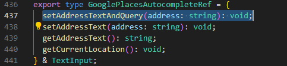
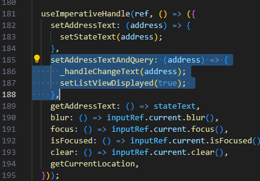

[](https://github.com/Smoothex/cloud-based-traffic-light-assistant/actions/workflows/eas-android-apk-build.yaml)

# Prerequisites

- npm version: ~10.8.2
- Node.js version: ~21.7.3

# Changes in libraries

1. react-native-google-places-autocomplete
   - Go to node_modules and find the library.
   - In GooglePlacesAutocomplete.d.ts go to line 437 and add the following code:
   ```
   setAddressTextAndQuery(address: string): void;
   ```
   
   - In GooglePlacesAutocomplete.js go to line 185 and add the following code:
   ```
   setAddressTextAndQuery: (address) => {
      _handleChangeText(address);
      setListViewDisplayed(true); 
   },
   ```
   
   - This allows for results to be queried when the user uses text input by voice.

# How to build the app using EAS CLI

1. In the terminal install eas-cli using `npm install -g eas-cli`.
1. Create an account for [Expo Dev](expo.dev).
1. Log in with your credentials using `eas login`.
1. Configure your project using `eas build:configure`, which creates an 
`eas.json` file with configs.
1. Either build the `android` folder locally with  `npx expo prebuild` or skip this step because it happens automatically in the pipeline.
1. Don't forget to set the `LOCAL_IP_ADDRESS` variable in the `app/index.tsx` file. (See [Troubleshooting](#troubleshooting) for more info)
1. Add the environmental variables from your `.env` file in Secrets of your Expo project on the Expo dev page in order to build the app correctly.
1. Start a building pipeline with `eas build -p android --profile development`.
1. After the pipeline succeeds you can download the <em>.apk</em> on your file via the link from your terminal or you can find it in Builds on the Expo dev page.
1. After installing the app on your physical device you have to start a server with `npx expo start`.

# How to run the app using Expo Go

1. Install Expo Go on your physical device from [Google Play](https://play.google.com/store/apps/details?id=host.exp.exponent&pcampaignid=web_share) for Android or [App Store](https://apps.apple.com/us/app/expo-go/id982107779) for iOS.

1. Install dependencies by running `npm install` in the terminal.

1. Set the `EXPO_PUBLIC_GOOGLE_API_KEY` environment variable in the `.env` file. This project uses Google APIs, so you need to configure an API Key in your [Google Cloud](https://console.cloud.google.com) account.

1. Set the `EXPO_PUBLIC_TU_USER_AUTH_TOKEN` environment variable in the `.env` file. This is the combination of `username:password` converted to base64 code. You could use this ([online converter](https://base64.guru/converter)) for this purpose.

1. Set the `LOCAL_IP_ADDRESS` variable in the `app/index.tsx` file. (See [Troubleshooting](#troubleshooting) for more info)

1. For macOS or Linux run `npm start` to start the app. For Windows run `node ./server/server.js` and then in a new terminal `npx expo start`.

1. On your device, open Expo Go and scan the QR code to connect to the development server. When the project starts loading, you see this in the terminal, see the gif below.
   
   


# Build

Using GitHub Actions we have created a workflow for building an APK app for Android. It uses [Expo Application Services (EAS)](https://expo.dev/eas) and specifically [EAS Build](https://docs.expo.dev/build/introduction/), which builds the app binary for the project.

The build command starts the build process on the EAS Build servers by default. Since [EAS is a paid service](https://expo.dev/pricing#pay-as-you-grow), the free tier is restricted to 30 builds per month. In order to avoid this limited number of builds, the `eas build` command in the pipeline uses the `--local` flag. This allows for running the same build process locally on the machine instead of in the Expo's managed environment. Although [building locally has some limitations](https://docs.expo.dev/build-reference/local-builds/#limitations), the local builds do not count to the said free 30 builds per month.

Unfortunately, Expo secrets can only be accessed by EAS cloud builds, and the local builds inside the GitHub runners can't access the Google Geolocation API key we need for the maps. Therefore, we set the `EXPO_PUBLIC_GOOGLE_API_KEY` variable as a repository secret and include it in the workflow.


# Express server

To start the Express server, use the npm start command. This command runs the application in the Metro Builder. By default, the server listens on `localhost:3000`, so ensure that no other application is using this port. For further configuration, have a look at the [official express docs](https://expressjs.com/en/5x/api.html).

To ensure accessibility by the server, place the files in the `./server/data/*` directory. These files, containing Maps data, should follow the naming convention `MAPS_<identifier>.json` (e.g., MAPS_643@49030.json) and must be of type JSON.

# Troubleshooting

- If the application doesn't have access to our local express server, first check if the wifi is switched on. 

- Next for macOS or Linux users, execute `ifconfig en0` in the terminal, which gives you the IP address assigned to the interface. This inet address, e.g. `192.168.1.101` needs to be copied to the `LOCAL_IP_ADDRESS` variable in the `app/index.tsx` file.

- For Windows user, execute the `ipconfig` command and look for the `IPv4 Address`. Place the IP address in the `LOCAL_IP_ADDRESS` variable in the `app/index.tsx` file.

#### TODO
- add this inet address in separate config file


